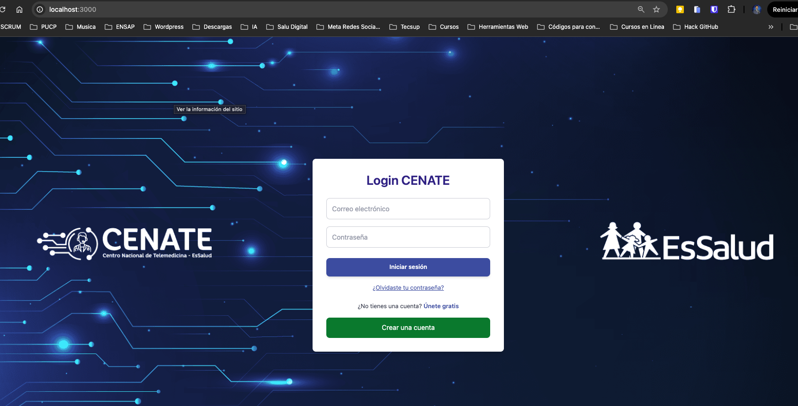
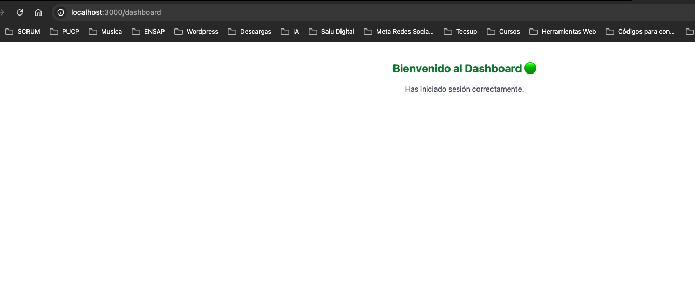
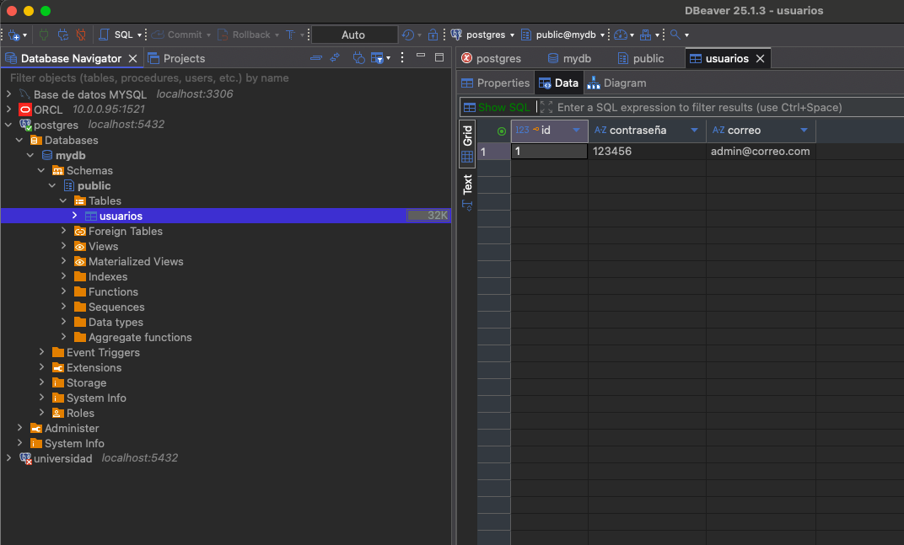

# 🔐 Proyecto de Autenticación - Spring Boot + React + Docker

Este proyecto implementa un sistema de autenticación robusto utilizando Spring Boot para el backend, React para el frontend, PostgreSQL como base de datos, y Docker para la contenerización.

---

## 🎯 Objetivos Técnicos

- Implementar autenticación basada en correo y contraseña con cifrado.
- Gestionar recuperación y reinicio de contraseña por token temporal.
- Asegurar las rutas de API mediante Spring Security.
- Exponer endpoints RESTful seguros y validados.
- Integrar una arquitectura profesional y escalable.

---


## ⚙️ Tecnologías Usadas

| Componente      | Tecnología                           |
|----------------|---------------------------------------|
| Backend         | Spring Boot 3.x (Java 17)            |
| Seguridad       | Spring Security + JWT (en futuro)    |
| Base de datos   | PostgreSQL 15+                        |
| Frontend        | React + Vite + Tailwind CSS          |
| Contenerización | Docker + Docker Compose              |

---

Este backend está construido con Spring Boot y expone una API REST para autenticación, manejo de usuarios y un endpoint de salud para monitoreo. La aplicación está configurada para ejecutarse en Docker y conectarse a una base de datos PostgreSQL.

## Estructura de la API

| Endpoint               | Método | Descripción                                                   | Respuesta Ejemplo             |
|------------------------|--------|---------------------------------------------------------------|------------------------------|
| `/health`              | GET    | Endpoint de healthcheck, indica si el backend está activo.    | `{ "status": "ok" }`          |
| `/auth/ping`           | GET    | Endpoint simple para probar que la autenticación está disponible. | `Pong`                       |
| `/auth/login`          | POST   | Realiza login con correo y contraseña, devuelve token JWT.     | `{ "token": "eyJhbGciOi..." }` |
| `/auth/register`       | POST   | Registra un nuevo usuario.                                     | `"Usuario registrado correctamente."` |
| `/auth/forgot-password`| POST   | Solicita token para restablecer contraseña.                    | Mensaje de confirmación        |
| `/auth/reset-password` | POST   | Restablece contraseña usando token.    

- Este backend está construido con Spring Boot y expone una API REST para autenticación, manejo de usuarios y un endpoint de salud para monitoreo. La aplicación está configurada para ejecutarse en Docker y conectarse a una base de datos PostgreSQL.


- La seguridad está configurada con JWT y CORS habilitado para cualquier origen (para desarrollo).


## Comandos útiles
- Para probar los endpoints desde el host (con backend en Docker):

```bash
curl http://localhost:8080/health
curl http://localhost:8080/auth/ping

```


- Para probar desde el front:

```bash
curl http://localhost:8080/auth/ping
```
- Frontend (frontend/.env)
```` 
VITE_API_URL=/api

````

## 🔧 Configuración de Variables de Entorno
Backend (.env.production)
```bash
ENVIRONMENT=production

POSTGRES_DB=mydb
POSTGRES_USER=postgres
POSTGRES_PASSWORD=postgres

SPRING_PORT=8080
SPRING_DATASOURCE_URL=jdbc:postgresql://db:5432/mydb
SPRING_DATASOURCE_USERNAME=postgres
SPRING_DATASOURCE_PASSWORD=postgres
SPRING_JPA_HIBERNATE_DDL_AUTO=update

FRONTEND_PORT=80
VITE_API_URL=/api

SMTP_HOST=disabled
SMTP_PORT=0
SMTP_USERNAME=
SMTP_PASSWORD=
SMTP_FROM=noreply@localhost

```

## 🧱 Estructura del Proyecto

```bash
3.Proyecto_Login_Springboot/
├── backend/
│   ├── controller/
│   │   └── AuthController.java
│   ├── service/
│   │   ├── AuthService.java
│   │   └── PasswordResetService.java
│   ├── repository/
│   │   └── UsuarioRepository.java
│   ├── entity/
│   │   └── Usuario.java
│   ├── config/
│   │   └── SecurityConfig.java
│   └── application.properties
├── frontend/ # Proyecto React (Vite + Tailwind)
│ ├── Dockerfile
│ └── src/
│
├── docker-compose.yml # Orquestador de servicios
└── README.md # Documentación técnica
```


---

## 📡 Pruebas de la API con curl
Estas pruebas permiten validar el correcto funcionamiento de los endpoints de autenticación en el backend.

### 🔄 Verificación de salud
```bash
Copiar
Editar
curl http://localhost:8080/auth/ping

```

### 📥 Respuesta esperada:

```nginx
Copiar
Editar
API funcionando
```

### 🆕 Registro de nuevo usuario
```bash
Copiar
Editar
curl -X POST http://localhost:8080/auth/register \
  -H "Content-Type: application/json" \
  -d '{"correo":"usuario@ejemplo.com", "contrasena":"123456"}'
```
### 📥 Respuesta esperada:

```nginx
Copiar
Editar
Usuario registrado correctamente.
```

### 🔐 Inicio de sesión
bash
Copiar
Editar
curl -X POST http://localhost:8080/auth/login \
  -H "Content-Type: application/json" \
  -d '{"correo":"usuario@ejemplo.com", "contrasena":"123456"}'
### 📥 Respuesta esperada (credenciales válidas):

```json
Copiar
Editar
{"success":true,"message":"Inicio de sesión exitoso"}
````

### 📥 Respuesta esperada (credenciales inválidas):

```json
Copiar
Editar
{"success":false,"message":"Credenciales inválidas"}
```
### 🧠 Solicitud de recuperación de contraseña
```bash
Copiar
Editar
curl -X POST http://localhost:8080/api/auth/forgot-password \
  -H "Content-Type: application/json" \
  -d '{"correo":"usuario@ejemplo.com"}'
```
### 📥 Respuesta esperada (modo desarrollo):

```java
Copiar
Editar
Token generado correctamente (modo desarrollo): <UUID-TOKEN>
📌 Guarda el token retornado para usarlo en el siguiente paso.
```
### 🔁 Restablecer contraseña con token
```bash
Copiar
Editar
curl -X POST http://localhost:8080/api/auth/reset-password \
  -H "Content-Type: application/json" \
  -d '{
    "token": "75c60477-e184-43cd-80d2-2b78b1aec808",
    "newPassword": "nuevaPasswordSegura123"
}'
```
### 📥 Respuesta esperada (token válido):

```css
Copiar
Editar
Contraseña actualizada correctamente.
```
### 📥 Respuesta esperada (token inválido o expirado):

```nginx
Copiar
Editar
Token inválido o expirado.
```
## ⚙️ Configuraciones .env (Frontend)

Archivo: `frontend/.env`

```yaml
VITE_API_URL=http://localhost:8080
```

Uso en React:
```js
const apiUrl = import.meta.env.VITE_API_URL;
```

## ▶️ Instrucciones para ejecutar

```bash
# Detener contenedores antiguos
docker-compose down

# Construir e iniciar todo el entorno
docker-compose up --build -d

```

Este documento describe las instrucciones para insertar usuarios, roles y asignar roles a los usuarios en la base de datos.

# Documentación de Inserción de Usuarios y Roles

Este documento describe las instrucciones para insertar usuarios, roles y asignar roles a los usuarios en la base de datos.


---
## Probando la inyecion de datos desde el Backend:

### Intento de login con usuario no registrado (fallará)
curl -X POST http://localhost:8080/auth/login \
  -H "Content-Type: application/json" \
  -d '{"correo":"styp611@outlook.com", "contrasena":"123456"}'

### Salida esperada: 
Credenciales inválidas%  

### Registro del usuario
curl -X POST http://localhost:8080/auth/register \
  -H "Content-Type: application/json" \
   -d '{"correo":"styp611@outlook.com", "contrasena":"123456"}'

#### Salida esperada:
Usuario registrado correctamente.

### Login con usuario registrado (éxito)
curl -X POST http://localhost:8080/auth/login -H "Content-Type: application/json" -d '{"correo":"styp611@outlook.com", "contrasena":"123456"}'


### Salida esperada:
 {"token":"<jwt_token_aqui>"}


Por comando Postgress

## 1. Insertar Usuarios en la Tabla `usuarios`

Asumiendo que la columna `id` es de tipo serial/autoincremental, se pueden insertar usuarios con sus correos y contraseñas (hash bcrypt) de la siguiente manera:

```sql
INSERT INTO usuarios (correo, contrasena) VALUES
('juan.perez@example.com', '$2a$10$7Q8rG/7XqjRtMGHU6xzJj.1QGlJqN/OX4.oyZZhuXcdh1LQEjRoxK'), -- password: user123
('maria.lopez@example.com', '$2a$10$WvF4Wpq7VgDmc3uMaP69COkD6HLb0MG5QKdPoOENYtJpiqMylNp9O'), -- password: user456
('admin@example.com', '$2a$10$k7a7eqzFGqV03lNz2BWY9eKxX1Om0Rmx0V.kO9bS/jjDfV8ewcQiS');  -- password: admin789
```

## 2. Insertar Roles en la Tabla  `roles`
Si aún no existen, insertar los roles necesarios:

```sql
INSERT INTO roles (id, nombre) VALUES
(1, 'ROLE_USER'),
(2, 'ROLE_ADMIN');

```

## 3. Asignar Roles a Usuarios en la Tabla `usuario_roles`
Asumiendo que los IDs generados para los usuarios son 1, 2 y 3 respectivamente:

```sql
INSERT INTO usuario_roles (usuario_id, rol_id) VALUES
(1, 1),  -- Juan Pérez: ROLE_USER
(2, 1),  -- María López: ROLE_USER
(3, 2);  -- Admin: ROLE_ADMIN
```


## 📦 Servicios Disponibles

| Servicio         | URL/Descripción                             |
|------------------|---------------------------------------------|
| 🖥️ **Frontend**   | [http://localhost:5173](http://localhost:5173) |
| 🧩 **Backend**    | [http://localhost:8080](http://localhost:8080) (API REST) |
| 🛢️ **PostgreSQL** | Expuesto internamente por Docker (puerto `5432`) |

---

## 🧩 Spring Boot: Componentes Incluidos

| Módulo                 | Descripción                                                       |
|------------------------|-------------------------------------------------------------------|
| **Spring Web**         | Define controladores REST y manejo de peticiones HTTP             |
| **Spring Data JPA**    | Abstracción para acceso y manipulación de datos con PostgreSQL    |
| **Spring Boot Devtools** | Facilita recarga automática durante desarrollo (Hot Reload)      |
| **PostgreSQL Driver**  | Driver JDBC para conexión con base de datos PostgreSQL            |
| **Spring Security**    | Gestión de autenticación y autorización, incluyendo JWT           |
| **Spring Boot Actuator** | Monitoreo y métricas del backend (opcional, si lo usas)          |

---

## 🧠 Arquitectura del Sistema


               ┌──────────────────────────┐
               │      Usuario Final       │
               └──────────┬───────────────┘
                          │ Navegador (localhost)
                          ▼
         ┌────────────────────────────────────┐
         │        Frontend: React (Vite)      │
         │         + Tailwind CSS             │
         │    (Puerto 5173 en desarrollo)    │
         └────────────────┬───────────────────┘
                          │ Axios / fetch a
                          │ http://localhost:8080/api (o backend)
                          ▼
         ┌────────────────────────────────────┐
         │       Backend: Spring Boot API     │
         │       (Puerto 8080, contenedor)    │
         └────────────────┬───────────────────┘
                          │
                          ▼
         ┌────────────────────────────────────┐
         │    PostgreSQL - Base de Datos      │
         │       (Puerto 5432, contenedor)    │
         └────────────────────────────────────┘
```

Si usas producción con Nginx o un proxy inverso:
```text
Usuario Final
    │
    ▼
Nginx (Puerto 80)
    │
    ├── Frontend estático (React construido)
    │
    └── Proxy /api → Backend (Spring Boot)

```

✅ Cada servicio corre en su propio contenedor, orquestado por docker-compose.yml.

✅ Este entorno está preparado para desarrollo local y puede ser extendido fácilmente hacia entornos productivos.  
Puedes personalizar los puertos, credenciales y variables de entorno desde el archivo `.env`.

- Página de Login


- Prueba exitosa de Login


- Identificación de base de datos


---


### 📚 Rutas REST comunes (ejemplo base)

```http
GET    /api/usuarios
POST   /api/usuarios
GET    /api/citas
POST   /api/citas
PUT    /api/citas/{id}
DELETE /api/citas/{id}

```

---

## 🧠 Recuperación de contraseña

Se genera una nueva estructura:

```plaintext
mi-proyecto/
├── backend/
│   ├── src/
│   │   ├── main/java/com/miempresa/miapp/
│   │   │   ├── controller/
│   │   │   │   └── AuthController.java         ← ENDPOINTS: forgot-password, reset-password
│   │   │   ├── entity/
│   │   │   │   └── PasswordResetToken.java     ← TOKEN con vencimiento
│   │   │   ├── repository/
│   │   │   │   ├── UsuarioRepository.java
│   │   │   │   └── PasswordResetTokenRepository.java
│   │   │   ├── service/
│   │   │   │   └── EmailService.java           ← ENVÍA CORREO
│   │   │   └── model/                          ← (opcional) DTOs
│   │   └── resources/
│   │       └── application.properties          ← CONFIG MAIL SMTP
│   └── pom.xml
│
├── frontend/
│   ├── src/
│   │   ├── components/
│   │   │   ├── ForgotPassword.jsx              ← FORM ENVÍO DE CORREO
│   │   │   └── ResetPassword.jsx               ← FORM CAMBIO DE CONTRASEÑA
│   │   ├── App.jsx
│   │   ├── main.jsx
│   │   └── index.css
│   └── vite.config.js
│
├── docker-compose.yml                          ← (si usas contenedores)
└── README.md

```

Para entender la lógica de funconamiento, se diagramó el siguiente flujo:

```plaintext
[ForgotPassword.jsx] (usuario escribe su correo)
         │
         ▼
POST /api/auth/forgot-password ─────────► [AuthController.java]
                                               │
                                               ├── Busca al usuario
                                               ├── Genera token temporal
                                               ├── Guarda en BD (PasswordResetToken)
                                               └── Llama a EmailService para enviar correo
                                                           │
                                                           ▼
                                             [Token con URL enviado por Email]

         ▼
Usuario hace clic en el enlace: http://localhost:3000/reset-password?token=XYZ123

[ResetPassword.jsx] (usuario pone nueva contraseña)
         │
         ▼
POST /api/auth/reset-password ─────────► [AuthController.java]
                                               │
                                               ├── Valida token
                                               ├── Cambia la contraseña
                                               └── Elimina token

```

# 🚀 Preparación para Producción con Docker

Este documento resume las configuraciones clave implementadas para preparar el despliegue en producción de la aplicación con Docker.

## ✅ Checklist de Producción

| Tarea                                            | Estado |
|--------------------------------------------------|--------|
| Dockerfile frontend y backend optimizados        | ✅     |
| Base de datos no expuesta públicamente           | ✅     |
| Backend solo accesible internamente              | ✅     |
| Frontend en puerto 80                            | ✅     |
| `VITE_API_URL` apuntando al backend interno      | ✅     |
| Nginx configurado correctamente                  | ✅     |
| Variables `.env` listas                          | ✅     |
| Logs visibles con `docker-compose logs -f`       | ✅     |

---

## 🔧 Cambios Técnicos Clave

| Cambio                                                               | Razón                                                                 |
|----------------------------------------------------------------------|------------------------------------------------------------------------|
| `location /api/` en lugar de `location /api`                         | Evita errores de redirección con paths relativos                      |
| `proxy_http_version 1.1;`                                            | Mejora soporte para conexiones modernas y Keep-Alive                  |
| Nuevas cabeceras de seguridad (`Referrer-Policy`, `Permissions-Policy`) | Refuerzan protección frente a fugas de datos y uso de APIs del navegador |
| Mejoras en configuración de `gzip_*`                                 | Compresión más eficiente y robusta                                    |

---

## 📁 Estructura Final Esperada

- Frontend compilado y servido por **Nginx** en el puerto `80`
- Backend accesible internamente como `http://backend:8080`
- Las llamadas desde el frontend a la API son proxied mediante `/api`
- Seguridad y compresión activadas en Nginx
- Variables de entorno definidas al construir el contenedor del frontend (`VITE_API_URL`)
- No hay puertos abiertos innecesariamente al exterior

---

## 🧪 Verificación Rápida

- Accede al sitio en `http://localhost`
- Verifica en consola que las llamadas a la API vayan a `/api/...`
- Usa `docker-compose logs -f` para monitorear actividad en backend y frontend

---

> Si más adelante deseas habilitar HTTPS con Let's Encrypt (recomendado en producción pública), puedes agregar Nginx Proxy Manager o certbot en tu stack Docker.


## 📦 Migración del Proyecto a Otra PC

Para trasladar este proyecto a otro equipo manteniendo la base de datos y la configuración:

1. **Respaldar la Base de Datos**
   
   Puedes elegir entre dos métodos:

   - Usando `docker volume export`:
     ```bash
     docker volume export nombre_del_volumen > backup.tar
     ```

   - Usando `pg_dump`:
     ```bash
     docker exec -t NOMBRE_CONTENEDOR_DB pg_dump -U postgres -d mydb > backup.sql
     ```

2. **Copiar el Proyecto**

   - Copia todo el proyecto (código, `.env`, `docker-compose.yml`) y el archivo de backup generado al nuevo equipo.

3. **Levantar los Contenedores**

   En la nueva máquina, ubica el proyecto en una carpeta y ejecuta:
   ```bash
   docker-compose up -d


## 📌 Ideas a Futuro

A continuación se detallan posibles mejoras y extensiones técnicas del proyecto:

### 🔐 1. Autenticación con JWT (JSON Web Tokens)
- Reemplazar la autenticación basada en sesión por un sistema stateless con JWT.
- Firmar y validar tokens en cada request para proteger rutas privadas.
- Generar token de acceso y token de refresco (para renovar sesión sin volver a loguearse).

### 🖥️ 2. Frontend con React (Login y Recuperación)
- Crear un formulario de inicio de sesión totalmente funcional con manejo de errores.
- Implementar vistas para registro, recuperación de contraseña y restablecimiento con token.
- Gestionar estado de autenticación (tokens y expiración) desde el cliente.

### 📧 3. Notificaciones por Email (Producción)
- Integrar un proveedor de correo real como SendGrid, Mailgun o SMTP personalizado.
- Enviar token de recuperación vía email seguro.
- Incluir confirmaciones de registro y cambio de contraseña.

### 🛡️ 4. Roles y Permisos de Usuario
- Crear entidades `Rol` y `Permiso`, y relacionarlas con el usuario.
- Usar anotaciones como `@PreAuthorize("hasRole('ADMIN')")` para asegurar endpoints.
- Permitir distintas vistas y acciones en función del rol (Admin, Coordinador, Usuario).

### 📊 5. Auditoría de Inicios de Sesión
- Registrar eventos como login exitoso/fallido, cambios de contraseña, bloqueo por intentos fallidos.
- Guardar IP, navegador y timestamp.
- Visualizar el historial por usuario en un panel de administración.

### 📑 6. Documentación con Swagger / OpenAPI
- Integrar `springdoc-openapi` para generar documentación interactiva.
- Exponer rutas protegidas y públicas con descripciones claras.
- Probar las APIs desde Swagger UI (`/swagger-ui.html`) sin necesidad de Postman.
---


## Cómo ejecutar el proyecto

### Backend y base de datos (Docker Compose)

1. Construir las imágenes Docker necesarias para el backend y la base de datos:

```bash
docker-compose build
```
2. Levantar los contenedores que incluyen backend, base de datos y (opcionalmente) frontend si está configurado:
```bash
docker-compose up
```
Esto iniciará el backend en http://localhost:8080 y la base de datos PostgreSQL en el puerto 5432.

### Frontend (modo desarrollo local)
1. Navega a la carpeta del frontend:

```bash
cd frontend
```

2. Ejecuta el servidor de desarrollo con Vite:
```bash
npm run dev
```

3. Abre en tu navegador la siguiente URL para acceder al frontend:
```bash
http://localhost:5173
```

`Nota`: Asegúrate de que el backend esté corriendo (por ejemplo, a través de Docker Compose) para que el frontend pueda comunicarse correctamente con la API.

## 👨‍💻 Autor

**Styp Canto**  
🧠 Stack: Fullstack Java + React  
🎯 Propósito: Tener una **base sólida, profesional y escalable** para futuros desarrollos web.
